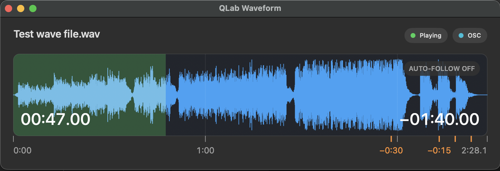

# QLab Waveform

QLab Waveform is a macOS companion app for QLab 5. It displays the waveform, playback progress, elapsed time, remaining time, and Auto-follow state of the currently playing or paused Audio cue.



This edition requires QLab 5 and macOS Big Sur 11 or newer. If you use QLab 4.7 or need Intel macOS Catalina support, see [QLab Waveform for QLab 4](https://github.com/PaddyPatPat/qlab-waveform-qlab4).

## Features

- Displays the selected region of the active WAV Audio cue.
- Smoothly interpolates playback progress and timers between QLab updates.
- Uses OSC for lightweight timing and events, with AppleScript for cue metadata and automatic fallback.
- Shows Playing, Paused, waiting, monitoring, and Auto-follow states.
- Marks the final 30, 15, 10, 5, 4, 3, 2, and 1 seconds with a fading orange background pulse while keeping the countdown digits white.
- Retains and dims the most recently displayed waveform after playback stops.
- Runs natively on Apple Silicon and Intel Macs.

## Requirements

- QLab 5.
- macOS Big Sur 11 or newer.
- A WAV Audio cue. Other compressed formats are not part of the current supported milestone.
- Permission for QLab Waveform to control QLab through macOS Automation.

## Download and install

1. Open the [latest GitHub release](https://github.com/PaddyPatPat/qlab-waveform/releases/latest).
2. Download `QLab-Waveform-0.4.0.zip` and expand it.
3. Move **QLab Waveform.app** into your Applications folder.
4. The current release is ad-hoc signed but not Apple-notarized. On first launch, Control-click or right-click the app and choose **Open**. If macOS still blocks it, open **System Settings → Privacy & Security** and choose **Open Anyway** for QLab Waveform.
5. Allow the requested Automation access. If access was previously denied, enable QLab Waveform under **System Settings → Privacy & Security → Automation**.
6. In QLab, enable **Allow OSC Connections** under Workspace Settings → Network.
7. If the workspace requires an OSC passcode, enter it in QLab Waveform and press Return or click **Connect**. Passcodes are held only in memory and are never saved.

Start or pause an Audio cue and the companion window should display its waveform. Click the **OSC** or **AppleScript** badge for live connection diagnostics.

## Current limitations

- One active Audio cue is displayed at a time.
- WAV is the supported media format for this milestone.
- Loop-aware presentation, multiple simultaneous cues, and complete playback-rate handling are not implemented.
- The app is not notarized, so first-launch Gatekeeper confirmation is expected.

## Build from source

The project is a Swift package. For a development build:

```sh
swift build
swift run QLabWaveform
```

To build the universal, ad-hoc-signed application bundle:

```sh
./scripts/package-universal-app.sh
```

The result is `dist/QLab Waveform.app`, containing `arm64` and `x86_64` executable slices targeting macOS 11 or newer.

## Licence

Copyright © 2026 Patrick Duncan.

QLab Waveform is free software licensed under the GNU General Public License, version 3 only (`GPL-3.0-only`). See [LICENSE](LICENSE).

QLab is a trademark of Figure 53, LLC. This project is independent and is not affiliated with, endorsed by, or supported by Figure 53.
